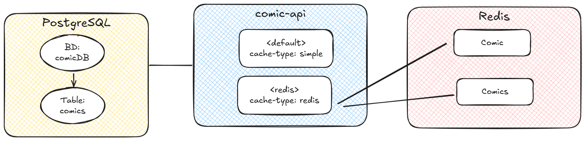

= springboot-caching-postgresql

The goal of this project is to explore how caching works. For it, we are going to implement a simple https://docs.spring.io/spring-boot/index.html[`Spring Boot`] application called `comic-api`. We are using PostgreSQL for storage and, for caching, we can pick one of the following providers: https://docs.spring.io/spring-boot/reference/io/caching.html#io.caching.provider.simple[`Simple`] or https://redis.io/[`Redis`].

== Project Diagram

== Applications
comics-api
`Spring Boot` Web Java application that has endpoints to manage comics. Data is stored in `PostgreSQL` and caching handled by `Simple` or `Redis`.
+
image::documentation/comic-api-swagger.jpeg[]

== Caching

The application uses 2 caches: `COMIC` and `COMICS`.

Caching is applied at service level. For instance, if you call `GET /api/comic?name=batman` for the first time, the application will check whether the comic with the name `batman` is present in the `COMIC` cache; if not, it must go to DB to get the information about the comic (payload). Let's say that the payload is:

[source]
----
{ "name": "batman", "datePublished": "2020-10-10" }
----

Before the endpoint finishes and returns the result, the key and its payload are saved in `COMIC` cache:

[source]
----
{ "batman" = {"name": "batman", "datePublished": "2020-10-10" }
----

On subsequent calls to `GET /api/comic?name=batman`  (and as far as the data is not evicted), the application just needs to go to the cache and get the value.

Additionally, caching is implemented when retrieving all comics. Whenever a comic is added or updated, the `COMICS` cache is evicted and repopulated on the next request to fetch all comics.
----
/api/comic/all
----